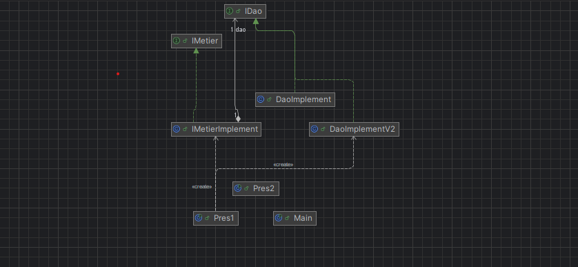
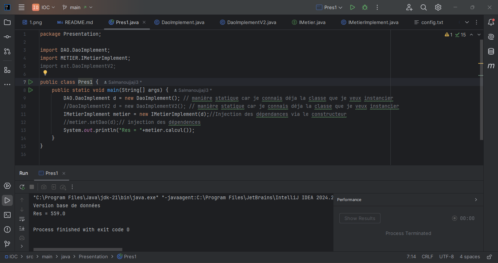
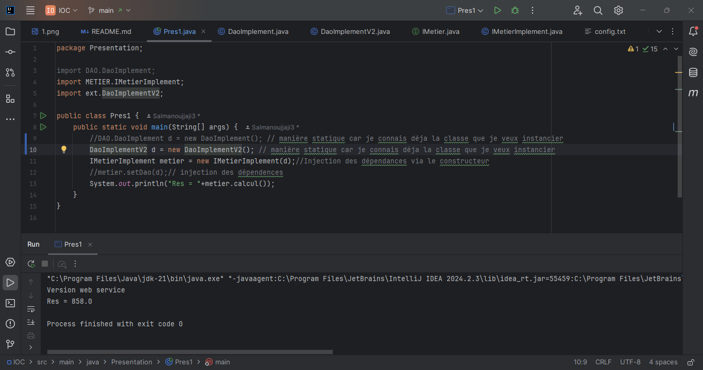
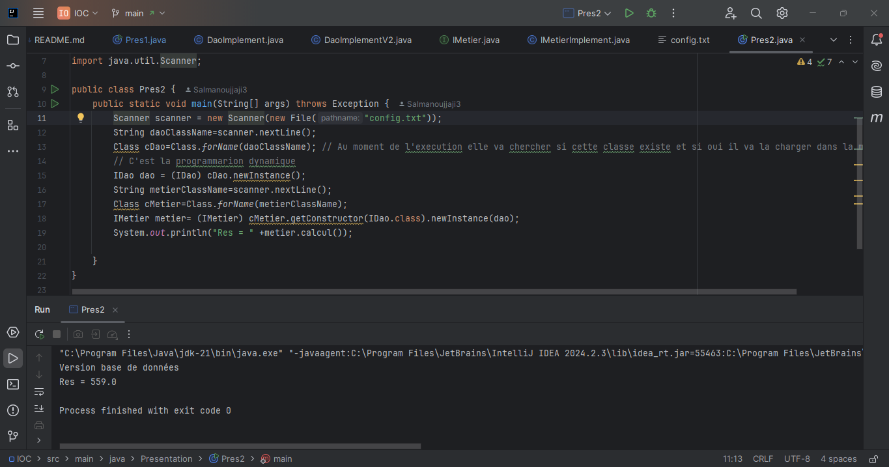
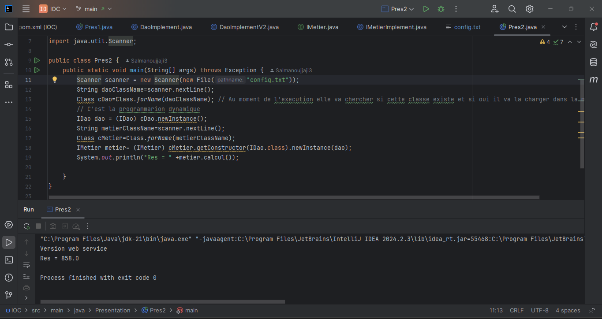

<h1> Compte rendu du premiere partie du TP : Injection des dépendenses</h1>
<h2> Diagramme de classe : </h2>

<h2> Résultat d'exécution : </h2>
<h3>L'injection des dépendences avec l'instanciation statique : </h3>
<h4> Version base de données </h4>

<h4> Version web service </h4>

<h3>L'injection des dépendences avec l'instanciation dynamique :</h3>
<h4> Version base de données </h4>

<h4> Version web service </h4>

